<div align="center">


<br>



<br>


</div>

---

## `> about_me`

```yaml
name: Rudra Bhuyan
location: Odisha, India
education: B.Tech in Computer Science and Engineering
graduation: 2027

focus:
  - Artificial Intelligence
  - Machine Learning
  - Computer Vision
  - Deep Learning
  - Multimodal AI

currently_working_on:
  - Facial Emotion Recognition
  - Occlusion-Robust Computer Vision
  - Lightweight AI Systems
  - Retrieval-Augmented Generation
```

---

## `> technology_stack`

<div align="center">

### Languages


### AI, ML and Computer Vision


### Data and Development Tools


</div>

---

## `> featured_projects`

<table>
<tr>
<td width="50%" valign="top">

### Occlusion-Aware Facial Emotion Recognition

A deep-learning system designed to identify facial expressions even when parts of the face are hidden.

**Tech:** Python, PyTorch, OpenCV, Computer Vision

</td>
<td width="50%" valign="top">

### PLUTO — Multimodal RAG

A multimodal retrieval system combining text, speech, evidence retrieval and uncertainty-aware responses.

**Tech:** Python, Llama, Whisper, RAG

</td>
</tr>

<tr>
<td width="50%" valign="top">

### MIL-SHIELD

An intelligent security platform combining intrusion detection, anomaly analysis and encrypted communication.

**Tech:** Python, Random Forest, Autoencoder, Flask

</td>
<td width="50%" valign="top">

### Green Guardian

A smart waste-management platform for reporting, collection coordination and route optimization.

**Tech:** Python, Machine Learning, Web APIs

</td>
</tr>
</table>

---

## `> github_analytics`

<div align="center">


<br><br>


</div>

---

## `> contribution_activity`

<div align="center">


</div>

---

## `> connect_with_me`

<div align="center">

<a href="mailto:bhuyanrudra117@gmail.com">
  
</a>

<a href="https://www.linkedin.com/in/rudra-bhuyan-771387290">
  
</a>

<a href="https://twitter.com/rudrabhuya_n">
  
</a>

<a href="https://instagram.com/ru_draa_01">
  
</a>

</div>

---

```text
rudra@github:~$ echo "Research. Build. Test. Improve."
rudra@github:~$ █
```

<div align="center">


</div>
